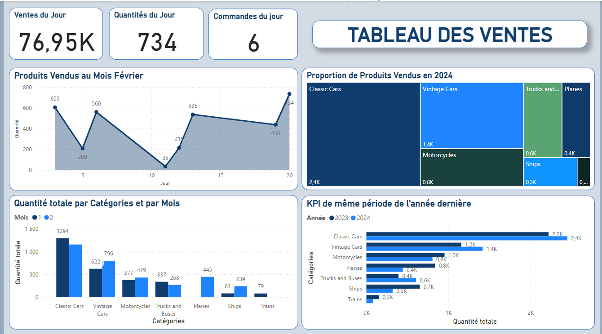
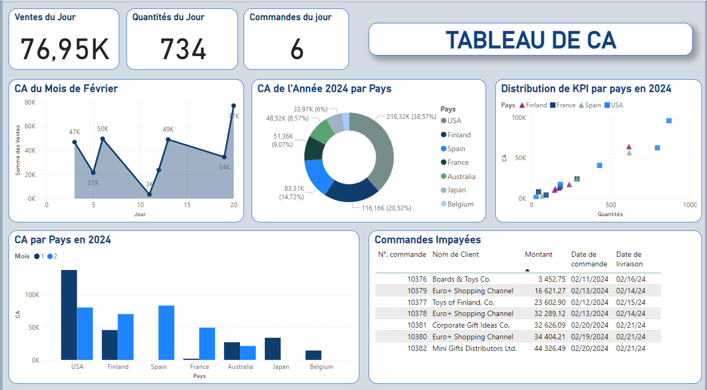

# Toys and Models / SQL - Powerbi
#### A project implemented in the Intensive Course for Data Analyst at Wild Code School
#### by Halil Ibrahim Celikel & Mai Tran & Nicolas Ortuno

## Summary of the Project

In this project, we were commissioned by a company selling models and scale models. The company already had a database that lists employees, products, orders, and much more. We were invited to browse and discover this database to create a dashboard which the director could refresh each morning to have the latest information in order to manage the company.

According to the directives, our dashboard should revolve around these 4 main topics: sales, finance, logistics, and human resources. Here are the indicators that should be present in our dashboard: 

1. Sales: The number of products sold by category and by month, with comparison and rate of change compared to the same month of the previous year.
2. Finances: 
  2.1. The turnover of the orders of the last two months by country. 
  2.2. Orders that have not yet been paid
3. Logistics: The stock of the 5 most ordered products.
4. Human Resources: Each month, the 2 sellers with the highest turnover.

## Project explaining step by step:
Step 1: Extract data from the database using SQL. 

Step 2: Analyze according to the directives.

Step 3: Create a Daily Dashboard using PowerBI to visualize all KPIs.

## The diagram of the database

Here is the diagram of the database:

## Screenshots of the Dashboard

- Sales dashboard

- Finance dashboard

- Human resources & Stocks dashboard

